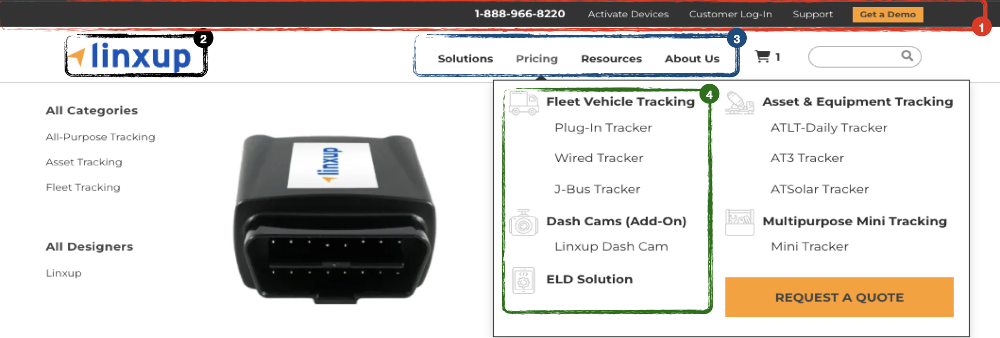

# Header

The **Header** component appears at the top of every page and serves as the main navigation element of the site.  
It includes the logo, primary navigation menu, search and cart icons.  
The header ensures visual consistency across pages and provides quick access to the main sections.

## 🎯 Example Component

### Construction

The **Header** component is currently built dynamically by making a request to **https://linxup.com/header**.  
The HTML returned from this endpoint is then injected directly into the page DOM, rendering the header content.  
This approach allows centralized control and updates to the header structure across multiple pages.

## Header Fields

### 1. Top Bar

- **Field:** Top CTAs
- **Location:** _Top Bar_ tab in **Globals → Megamenu**
- **Source:** **Craft CMS**
- **Usage:** Defines the call-to-action (CTA) buttons displayed in the header’s top bar. A new button is created for each Top CTA added in this section, allowing quick access to key pages or actions such as “Customer Login” or “Support”

### 2. Logo

- **Field:** Logo
- **Location:** _Logos_ tab under **Globals → Megamenu** in Craft CMS
- **Source:** **Craft CMS**
- **Usage:** Defines the logo displayed in the header. The field includes **Logos for Small Screens** and **Logo for Large Screens**, and the displayed logo changes dynamically based on the screen size breakpoint.

### 3. Menus

- **Field:** Nav Items
- **Location:** _Nav Items_ tab under **Globals → Megamenu** in Craft CMS
- **Source:** **Craft CMS**
- **Usage:** Defines the navigation structure of the header. Each **Nav Item** creates a new menu button, and its corresponding **Dropdown Column** determines the content and links shown within the dropdown menu.
  - The **Item Classes** field allows assigning custom CSS classes to specific menu items.
  - The **Column Style** field allows assigning custom CSS classes to individual dropdown columns for styling and layout customization.

### 4. Columns

- **Field:** Dropdown Column
- **Location:** Defined in each **Nav Item** under the _Nav Items_ tab in **Globals → Megamenu**, referencing entries from the **Navigation** section in Craft CMS
- **Source:** **Craft CMS**
- **Usage:** Determines the content and links displayed within each dropdown column of the header menu. Each **Dropdown Column** points to a specific **Navigation** entry, where individual items (links, titles, and groups) are configured to appear in that column.

### 5. Mobile Button

- **Field:** Mobile Button
- **Location:** _Mobile Button_ tab in **Globals → Megamenu**
- **Source:** **Craft CMS**
- **Usage:** Defines the button displayed at the bottom of the mobile navigation menu (when enabled). This button appears only on mobile devices and can be customize
