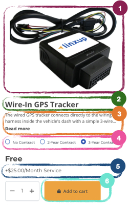

# Product Card

The **Product Card** component displays a summarized view of a product in listings, category pages, and promotional sections.  
It provides key product information such as image, name, price, and primary actions (e.g., add to cart or view details).

## 🎯 Example Component

## Product Card Fields

### 1. Images

- Sources: **Craft CMS** and **BigCommerce**
- Usage: Product images are displayed in a carousel on the PDP, combining assets from both systems.
- From **Craft CMS**:
  - Field: **Product Gallery**
  - Location: _Product Listing_ tab on the product entry
- From **BigCommerce**:
  - Tab: **Images**
  - Location: Product configuration in BigCommerce admin

### 2. Product Title

- Field: **Title**
- Location: _Metadata_ tab on the product entry in Craft CMS
- Source: **Craft CMS**
- Usage: Main product title displayed prominently at the top of the PDP and used in SEO metadata.

### 3. Product Description

- Field: **Page Description**
- Location: _Description_ tab on the product configuration in BigCommerce
- Source: **BigCommerce**
- Usage: Main description text displayed on the PDP, providing detailed information about the product.

### 4. Contract Options

- Sources: **Craft CMS** and **BigCommerce**
- From **Craft CMS**:
  - Field: **Monthly Service Type**
  - Location: _Product Listing_ tab on the product entry
  - Behavior:
    - If set to **Service Charged per device**, contract options are displayed as radio buttons.
    - If not, radio buttons are hidden and the product is treated as a single subscription fee per account.
- From **BigCommerce**:
  - Tab: **Variations**
  - Content: Defines **variant options** and their **labels**.
  - Each variant corresponds to a contract option and determines the **final product price**.

### 5. Product and Service Value

- Sources: **Craft CMS** and **BigCommerce**
- **Product Value**
  - If the **Monthly Service Type** (Craft CMS → _Product Listing_ tab) is set to **Service Charged per device**:
    - The product value is defined by the **selected contract option** (from BigCommerce → _Variations_ tab).
    - The final value is calculated by the chosen option **multiplied by the selected quantity**.
  - If the **Monthly Service Type** is set to **Service Charged per account**:
    - The product must contain **two variants** in BigCommerce:
      - **WithoutAccountServiceLevel** → Defines the price for accounts **without an existing service subscription**.
      - **WithAccountServiceLevel** → Defines the price for accounts **with an existing service subscription**.
    - To determine whether an account already has a subscription, see: **TODO** (logic to be defined).
- **Service Value**
  - Retrieved from the **Modifier Options** field.
  - Location: _Customizations_ tab in BigCommerce.
  - The service value is also **multiplied by the selected quantity**.

### 6. Add to Cart Button

- Field: **Add to Cart Button**
- Location: _Purchasability_ tab
- Source: **BigCommerce**
- Usage: Enables users to add the product directly to the cart from the card view.  
  Before rendering the button, the system checks the **Purchasability** field in BigCommerce.  
  If the option **“This product cannot be purchased in my online store”** is selected, the button will be displayed in a **disabled state** with the label **“Out of stock”**.
