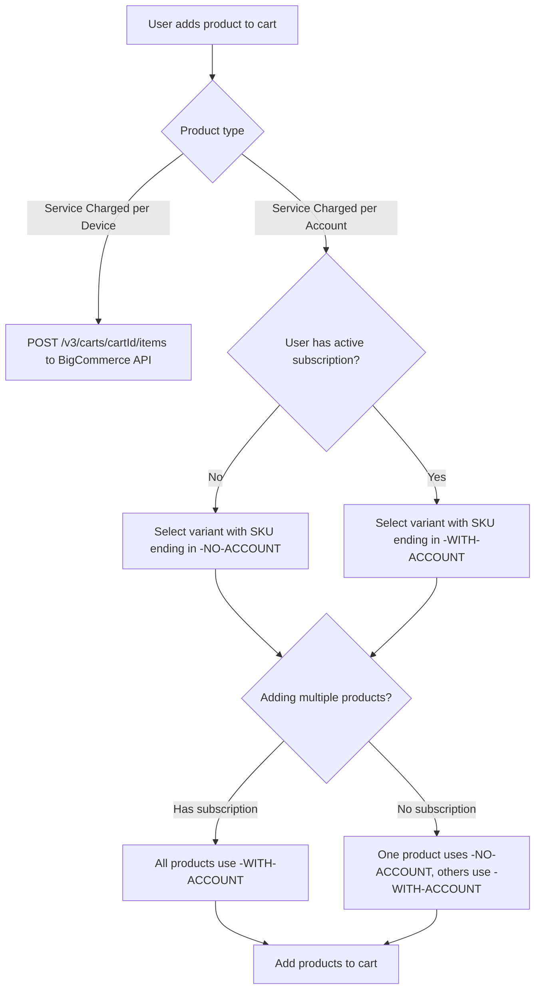

# Add Product to Cart

To add a product to the cart, the user must first select the contract type (if available) for that product.

Each contract option is defined as a **variant** in BigCommerce. The variant’s value represents the final price for that product, which includes both the base product and the selected contract.

When the user adds a product to the cart, the system first checks whether the product type is **Service Charged per Account** or **Service Charged per Device**.

#### Service Charged per Device

If the product is **Service Charged per Device**, a `POST` request is made to the BigCommerce API: `POST /v3/carts/${cartId}/items?include=line_items.physical_items.options,line_items.digital_items.options`

The request payload includes:

- The product (with its variant, quantity, and price)
- The store’s `channel_id`
- The user’s ID (if available)

#### Service Charged per Account

If the product is **Service Charged per Account**, the system must first check whether the current user already has an active subscription for that product type.

- If **no active subscription** exists, the system looks for the variant whose SKU ends with `-NO-ACCOUNT`, and that variant is added to the cart.
- If the user **already has an active subscription**, the system selects the variant whose SKU ends with `-WITH-ACCOUNT`.

When multiple products are added at once:

- If the user **has an active subscription**, all products are added using the `-WITH-ACCOUNT` variant.
- If the user **does not have an active subscription**, one product must use the `-NO-ACCOUNT` variant, while all others use the `-WITH-ACCOUNT` variant.

This logic is handled within the **Add Products** action.

#### Flow Diagram

