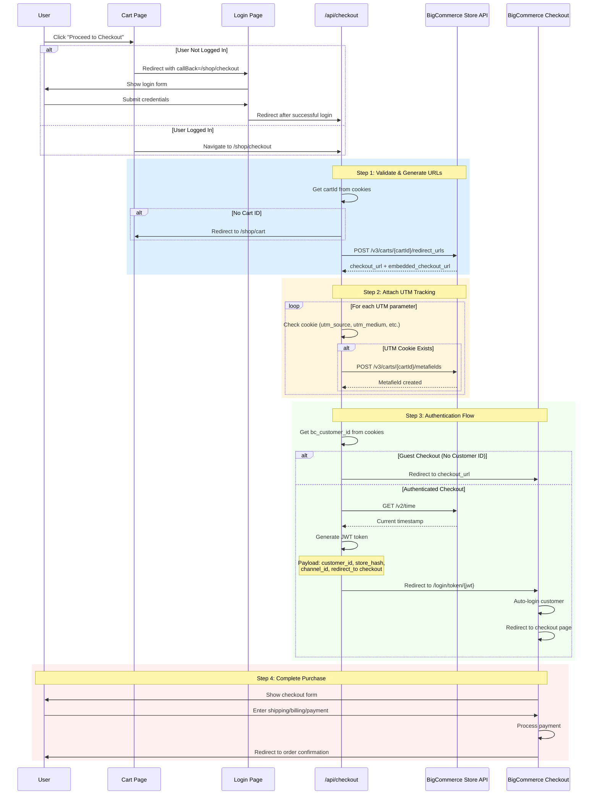

# Checkout

## Overview

The checkout flow redirects users from the cart to BigCommerce's hosted checkout page. The process handles both guest and authenticated customer checkouts, attaching UTM tracking parameters and generating secure JWT tokens for logged-in customers.

## Checkout Flow

The checkout process is initiated when users click "Proceed to Checkout" from the cart page or the sidebar and follows these steps:

### 1. Pre-Checkout Validation

**Purpose:** Ensure the cart exists and user is authenticated (if required)

**Process:**

- User clicks "Proceed to Checkout" button in cart
- If not logged in, redirects to `/shop/auth/login?callBack=/shop/checkout`
- After successful login, user is redirected to `/api/checkout` (GET request)

### 2. Cart Validation

**Purpose:** Verify cart exists before proceeding to checkout

**Process:**

- Handler retrieves `cartId` from cookies (`config.cartCookie`)
- If no cart ID exists, redirects back to `/shop/cart`
- Prevents checkout attempts with empty or invalid carts

### 3. Checkout URL Generation

**Purpose:** Request BigCommerce redirect URLs for the cart

**Process:**

- Calls BigCommerce Store API: `POST /v3/carts/${cartId}/redirect_urls`
- Response contains two URLs:
  - `checkout_url`: Full checkout page URL
  - `embedded_checkout_url`: Embedded checkout URL (for iframe integration)
- These URLs are single-use and expire after a period of inactivity

### 4. UTM Tracking Metafields

**Purpose:** Attach marketing attribution data to the cart

**Process:**

- Iterates through UTM parameters stored in cookies:
  - `utm_source`
  - `utm_medium`
  - `utm_campaign`
  - `utm_content`
  - `utm_term`
- For each present UTM cookie, creates a cart metafield via BigCommerce API
- Metafields are stored in the `utm` namespace with `read_and_sf_access` permission

**Note:** These metafields allow tracking campaign effectiveness through to order completion.

### 5. Customer Authentication Flow

**Purpose:** Determine checkout path based on authentication status

The checkout flow branches based on whether a customer ID exists in cookies:

#### Guest Checkout (No Customer ID)

**Process:**

- No `bc_customer_id` cookie found
- Redirects directly to `checkout_url`
- User proceeds as guest or creates account during checkout

#### Authenticated Checkout (With Customer ID)

**Purpose:** Generate secure JWT token to auto-login customer at checkout

**Process:**

1. Retrieves current server time from BigCommerce: `GET /v2/time`
2. Creates JWT payload with:

   - `iss`: Store API Client ID (issuer)
   - `iat`: Server timestamp (issued at)
   - `jti`: Unique UUID (JWT ID)
   - `operation`: `'customer_login'`
   - `store_hash`: BigCommerce store hash
   - `customer_id`: Customer entity ID
   - `channel_id`: Store channel ID
   - `redirect_to`: Checkout URL path (relative)

3. Signs JWT with store API client secret using HS256 algorithm
4. Constructs login URL: `${storeUrl}/login/token/${token}`
5. Redirects to login URL, which auto-authenticates customer and redirects to checkout

**Security Notes:**

- JWT tokens are single-use and time-limited
- Signed with store client secret to prevent tampering
- UUID ensures token uniqueness

### 6. Checkout Completion

**Purpose:** User completes purchase on BigCommerce hosted checkout

**Process:**

- User is on BigCommerce checkout page
- Cart items, customer info (if logged in), and UTM data are available
- User enters shipping, billing, and payment information
- After successful payment, BigCommerce processes the order
- User is redirected to order confirmation page

## Error Handling

The checkout endpoint includes error handling for common scenarios:

1. **Missing Cart:**

   - Redirects to `/shop/cart` if no cart ID in cookies
   - Prevents invalid checkout attempts

2. **API Errors:**

   - Caught by endpoint wrapper
   - Returns 500 status with error message
   - Generic error for security (doesn't expose internal details)

3. **Authentication Errors:**
   - If customer ID cookie is invalid or expired
   - Falls back to guest checkout flow
   - No error shown to user

## Configuration

The checkout flow relies on several environment variables and config values:

- `config.cartCookie`: Cookie name storing cart ID
- `config.storeUrl`: BigCommerce store URL
- `config.storeApiClientId`: BigCommerce OAuth client ID for JWT signing
- `config.storeApiClientSecret`: BigCommerce OAuth client secret for JWT signing
- `config.storeHash`: BigCommerce store hash
- `config.storeChannelId`: Channel ID for multi-storefront setups

## Login Integration

When a logged-out user attempts checkout:

1. Redirected to login page with callback: `/shop/auth/login?callBack=/shop/checkout`
2. After successful login (see [Login Flow](./login.md)):
   - `updateToolTrackersOnLogin` adjusts cart items for subscription status
   - User is redirected to `/api/checkout`
3. Checkout flow resumes with authenticated customer ID

## Checkout Flow Diagram

