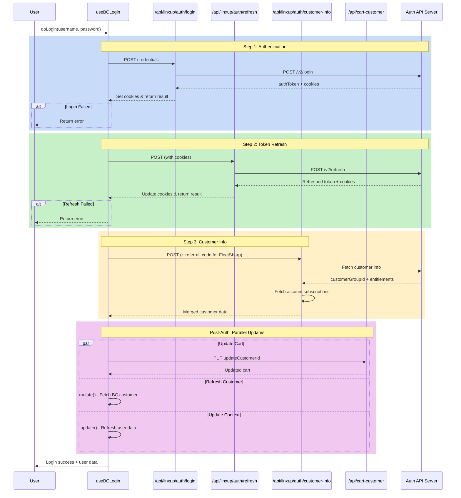

# Log in

## Overview

The login flow is orchestrated by the `useBCLogin` hook, which coordinates multiple API calls and state updates to authenticate users and synchronize their session across the application.

## Login Flow

The login process follows a sequential 3-step authentication flow:

### 1. Initial Authentication (`callLogin`)

**Purpose:** Authenticate user credentials with the auth API

**Process:**

- Sends username and password to `/shop/api/linxup/auth/login`
- The API route proxies the request to `ENV.authApiURL + '/v2/login'`
- Returns an `authToken`, server info, and authorization status
- Set the cookies from the response

### 2. Token Refresh (`callRefreshToken`)

**Purpose:** Refresh the authentication token to establish an active session

**Process:**

- Calls `/shop/api/linxup/auth/refresh` (no body required)
- Proxies to `ENV.authApiURL + '/v2/refresh'`
- Uses existing cookies from step 1 for authentication
- Updates session cookies with refreshed tokens

### 3. Customer Info & Entitlements (`callCustomerInfo`)

**Purpose:** Fetch customer group, entitlements, and account subscriptions

**Process:**

- Calls `/shop/api/linxup/auth/customer-info` with optional referral code params (FleetSharp only)
- Fetches account subscriptions

**Special Handling:** FleetSharp brand passes `referral_code` as a query parameter.

## Post-Authentication Updates

After successful authentication, the hook triggers three parallel state updates:

### 4. Update Cart Customer ID

**Purpose:** Associate the authenticated user with their shopping cart

**Process:**

- Calls `/shop/api/cart-customer` (PUT method)
- Updates the BigCommerce cart with the customer ID from cookies
- Mutates the cart state to reflect the logged-in user's cart

### 5. Refresh Customer Data

**Purpose:** Reload customer data from BigCommerce

**Process:**

- Uses the `useCustomer` hook's mutate function
- Fetches fresh customer data from BigCommerce API
- Updates customer state across the application

### 6. Update User Context

**Purpose:** Sync user data in the application context

**Process:**

- Calls the `update` function from `useUserData` context
- Updates active entitlements and user metadata
- Sets logged-in state throughout the application

## Error Handling

Each step in the login flow includes error handling:

1. **Network Errors:** Caught by the `redirectResponse` helper and returned as 400/500 status codes
2. **Authentication Failures:** Returned as `success: false` from the API
3. **Sequential Validation:** If any step fails, subsequent steps are skipped
4. **Cookie Management:** The `redirectResponse` helper handles cookie security attributes and domain configuration for different environments

## Environment-Specific Behavior

**Development Mode:**

- Cookie domains are rewritten to `localhost`
- `SameSite=None` is changed to `SameSite=Lax`
- `Secure` flag is removed for local testing

**Production Mode:**

- Cookies use the actual domain (e.g., `linxup.com`, `motosafety.com`)
- Security attributes are preserved as returned by the API

## Login Flow Diagram

