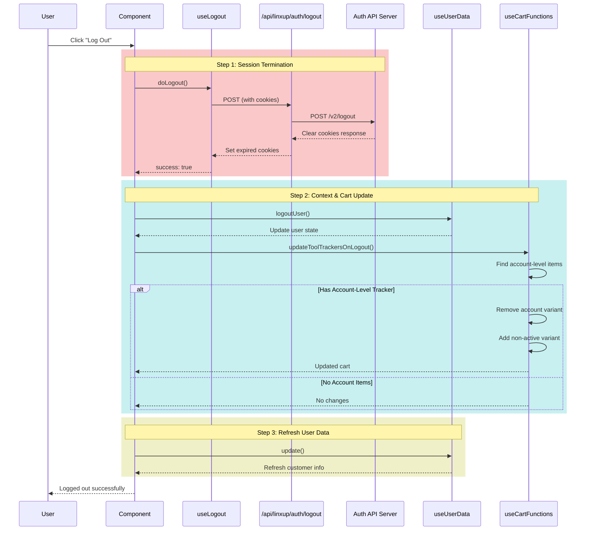

# Log out

## Overview

The logout flow terminates the user's session, clears authentication cookies, and updates the cart to reflect the logged-out state. The process is coordinated through multiple hooks and API calls.

## Logout Flow

The logout process follows a two-step flow with post-logout cleanup:

### 1. Session Termination (`useLogout`)

**Purpose:** Invalidate the user's session and clear authentication cookies

**Process:**

- Calls `/shop/api/linxup/auth/logout` (POST method)
- The API route proxies the request to `ENV.authApiURL + '/v2/logout'`
- Server forwards all cookies to the auth API for session invalidation
- Response includes `set-cookie` headers that clear/expire authentication cookies
- The `bc_customer_id` cookie is explicitly cleared

**Cookie Handling:**

- Auth cookies (`refresh_token`, `access_token`, `person_id`, etc.) are expired
- BigCommerce customer ID is cleared to disassociate the cart from the user

### 2. User Context Update

**Purpose:** Update application state and cart after logout

**Process:**

- Calls `logoutUser()` from `useUserData` context
- Updates user context to reflect logged-out state
- Calls `updateToolTrackersOnLogout()` to handle cart-specific cleanup

## Post-Logout Updates

### Cart Item Adjustment (`updateToolTrackersOnLogout`)

**Purpose:** Update cart items that require active subscription

**Process:**

For products with account-level service variants (Tool-trackers):

- Finds any cart items with account-level subscription SKU (ends with `ACCOUNT_LEVEL_SERVICE_VARIANT_SUFIX`)
- Checks if there's already a non-active variant (ends with `NO_ACCOUNT_LEVEL_SERVICE_VARIANT_SUFIX`)
- If an account-level item exists without a non-active variant:
  - Removes one account-level variant from cart
  - Adds one non-active variant with the same quantity
  - Maintains cart state with appropriate product variant for logged-out users

## Error Handling

The logout flow includes error handling at multiple levels:

1. **API Errors:**

   - Network failures return 500 status with error details
   - Auth API errors are proxied with original status codes
   - Failed logout attempts return `success: false`

2. **Cookie Cleanup:**

   - Cookies are always cleared client-side via `set-cookie` headers
   - Even if logout API fails, cookies are expired to prevent stale sessions

3. **Cart Updates:**
   - Cart adjustments only happen if cart data exists
   - Missing products are handled gracefully (no-op if product not found)
   - Cart mutations update local state to prevent stale data

## Environment-Specific Behavior

**Development Mode:**

- Cookie `Secure` flag is removed for localhost
- `SameSite=None` is changed to `SameSite=Lax`
- Allows cookies to work without HTTPS

**Production Mode:**

- Cookies maintain security attributes
- Domain-specific cookies are preserved
- Full security headers are enforced

## Logout Flow Diagram

