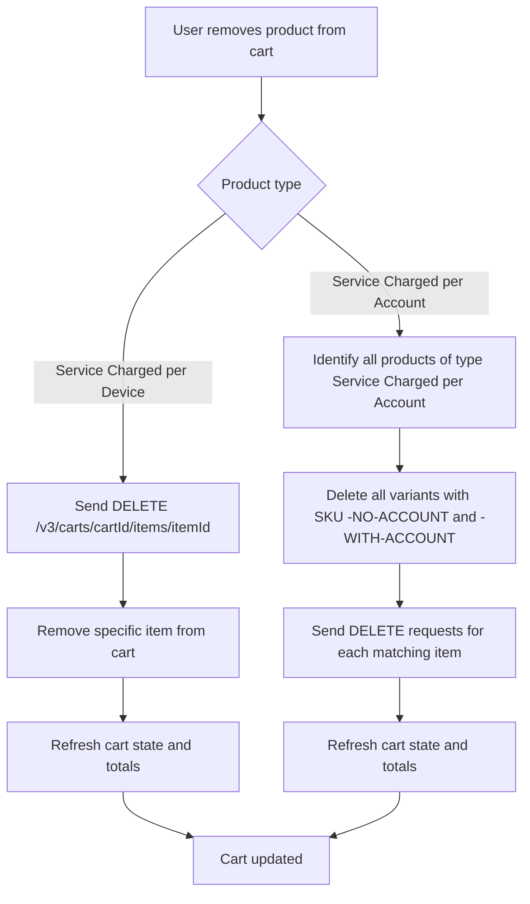

# Remove Product from Cart

When a user removes a product from the cart, the system identifies the corresponding line item in the BigCommerce cart and requests its deletion.

Each product in the cart is represented by a unique `itemId`, which is required for the removal operation.

When the user removes a product to the cart, the system first checks whether the product type is **Service Charged per Account** or **Service Charged per Device**.

#### Service Charged per Device

To remove a product, a `DELETE` request is sent to the BigCommerce API: `DELETE /v3/carts/${cartId}/items/${itemId}?include=line_items.physical_items.options`

The request includes:

- `cartId`: the identifier of the cart
- `itemId`: the specific line item to be removed

After a successful response, the local cart state is refreshed to reflect the updated list of items and totals.

#### Service Charged per Account

If the product is **Service Charged per Account**, the system must delete all **Service Charged per Account** products. Including variants ending with `-NO-ACCOUNT` and `-WITH-ACCOUNT`.

#### Flow Diagram

