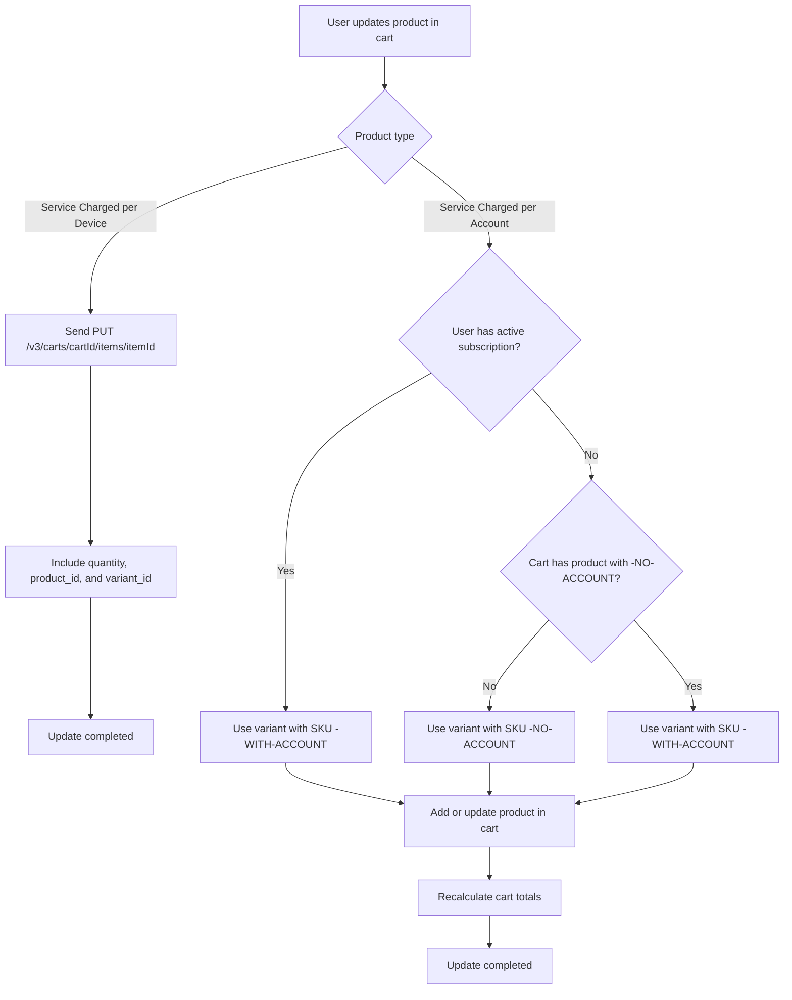

# Update Product in Cart

When a user updates a product in the cart — for example, changing its quantity — the system determines which item in the BigCommerce cart should be updated and how the change affects the variant or pricing.

Each product in the cart corresponds to a line item in BigCommerce, identified by a unique `itemId`.

When the user updates a product in the cart, the system first checks whether the product type is **Service Charged per Account** or **Service Charged per Device**.

#### Service Charged per Device

To update a product, a `PUT` request is sent to the BigCommerce API: `PUT /v3/carts/${cartId}/items/${itemId}?include=line_items.physical_items.options`

The request payload includes:

- `quantity`: the new quantity for that item
- `product_id` and `variant_id`: to ensure the correct variant is being updated

#### Service Charged per Account

If the product is **Service Charged per Account**, the system must first check whether the current user already has an active subscription for that product type.

- If **no active subscription** exists and user doesn't have a product with no subscription in the cart , the system looks for the variant whose SKU ends with `-NO-ACCOUNT`, and that variant is added to the cart.
- If **no active subscription** exists and user already have a product with no subscription in the cart , the system looks for the variant whose SKU ends with `-WITH-ACCOUNT`, and that variant is added to the cart.
- If the user **already has an active subscription**, the system selects the variant whose SKU ends with `-WITH-ACCOUNT`.

#### Flow Diagram

