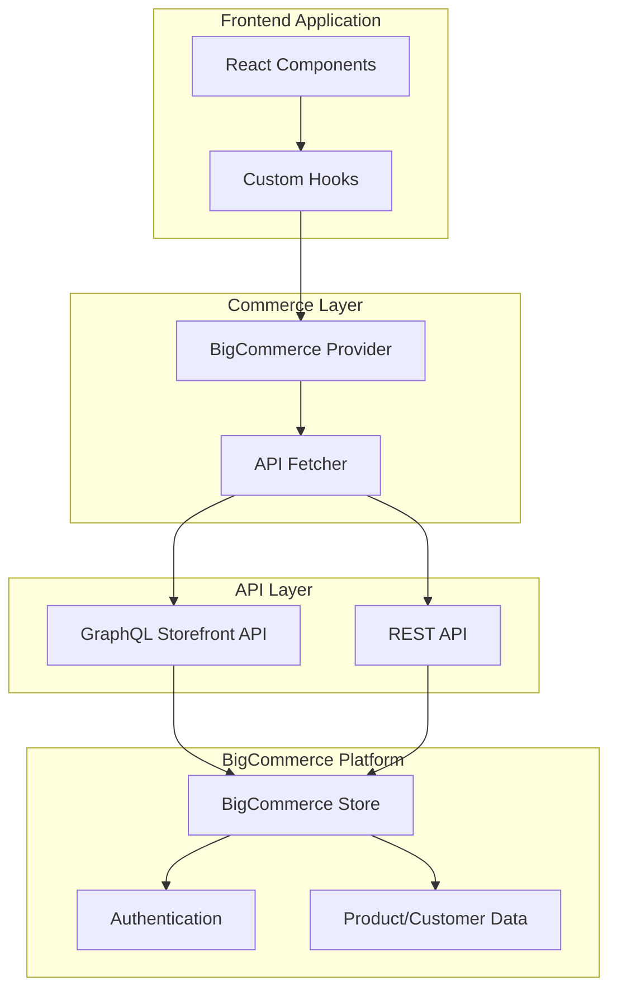
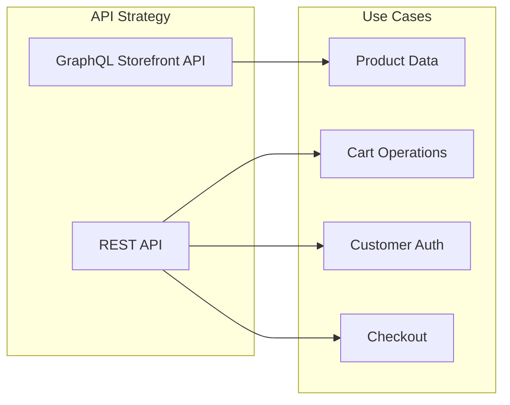
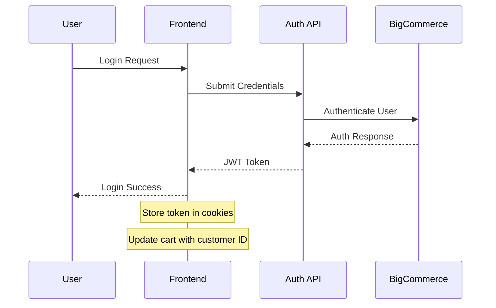
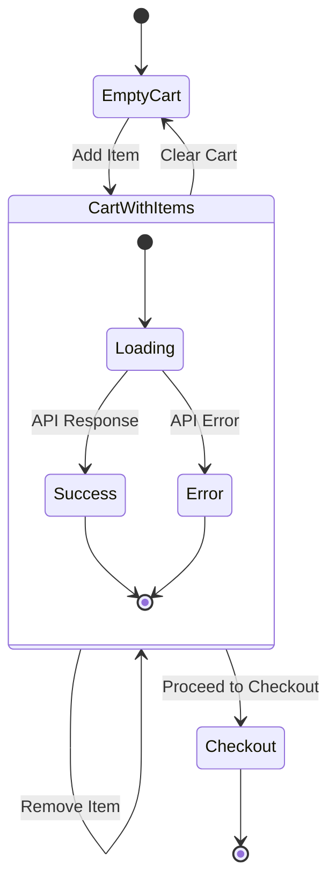
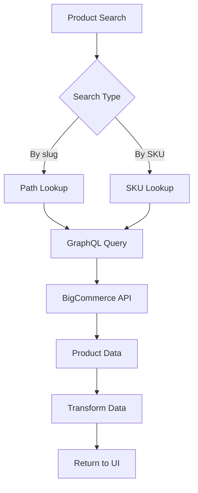

# BigCommerce Integration

This guide explains how the project integrates with the BigCommerce API to provide comprehensive e-commerce functionality. The integration leverages both BigCommerce's GraphQL Storefront API and REST API to deliver a seamless headless commerce experience.

## Architecture

The integration follows a layered architecture that abstracts BigCommerce's APIs behind a unified interface:



## Configuration

The integration requires several environment variables to be configured:

### Required Environment Variables

```bash
# GraphQL Storefront API
BIGCOMMERCE_STOREFRONT_API_URL=https://your-store.mybigcommerce.com/graphql
BIGCOMMERCE_STOREFRONT_API_TOKEN=your_storefront_token
BIGCOMMERCE_STORE_API_STORE_HASH=your_store_hash

# REST API
BIGCOMMERCE_STORE_API_URL=https://api.bigcommerce.com/stores/your-store-hash/v3
BIGCOMMERCE_STORE_API_TOKEN=your_rest_api_token
BIGCOMMERCE_STORE_API_CLIENT_ID=your_client_id

BIGCOMMERCE_CHANNEL_ID=your_channel_id
BIGCOMMERCE_STORE_URL=https://your-store.mybigcommerce.com
BIGCOMMERCE_STORE_API_CLIENT_SECRET=your_client_secret
BIGCOMMERCE_CART_COOKIE=bc_cartId
```

## API Architecture

The integration uses a dual API approach:



### GraphQL Storefront API

- **Purpose**: Product catalog, and storefront data
- **Authentication**: Bearer token
- **Features**: Real-time product data, optimized queries

### REST API

- **Purpose**: Cart operations, checkout, and administrative operations
- **Authentication**: X-Auth-Token and X-Auth-Client headers
- **Features**: Full CRUD operations, customer data management

## Authentication Flow

The authentication system supports both guest and registered users:



### Authentication Features

- **Customer Login**: Email/password authentication
- **Customer Registration**: New account creation
- **Session Management**: JWT token-based sessions
- **Cart Association**: Link guest carts to customer accounts
- **Logout**: Secure session termination

## Cart Operations

The shopping cart system provides persistent cart functionality:



### Cart Features

- **Persistent Storage**: Cart data stored in cookies
- **Guest Support**: Anonymous cart functionality
- **Customer Linking**: Associate guest carts with customer accounts
- **Real-time Updates**: Immediate UI updates on cart changes
- **Metafield Support**: Custom cart metadata

## Product Operations

Product management leverages BigCommerce's GraphQL API for optimal performance:



### Product Features

- **Search**: Full-text product search
- **Filtering**: Category and attribute filtering
- **Pagination**: Efficient data loading
- **Product Details**: Complete product information
- **Variants**: Product option handling
- **Inventory**: Stock level management
