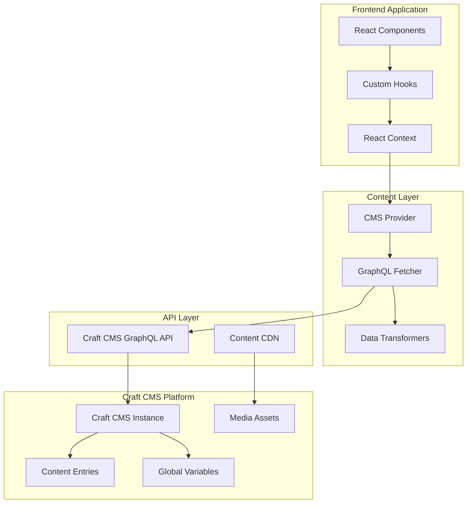
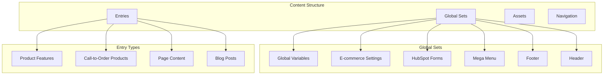
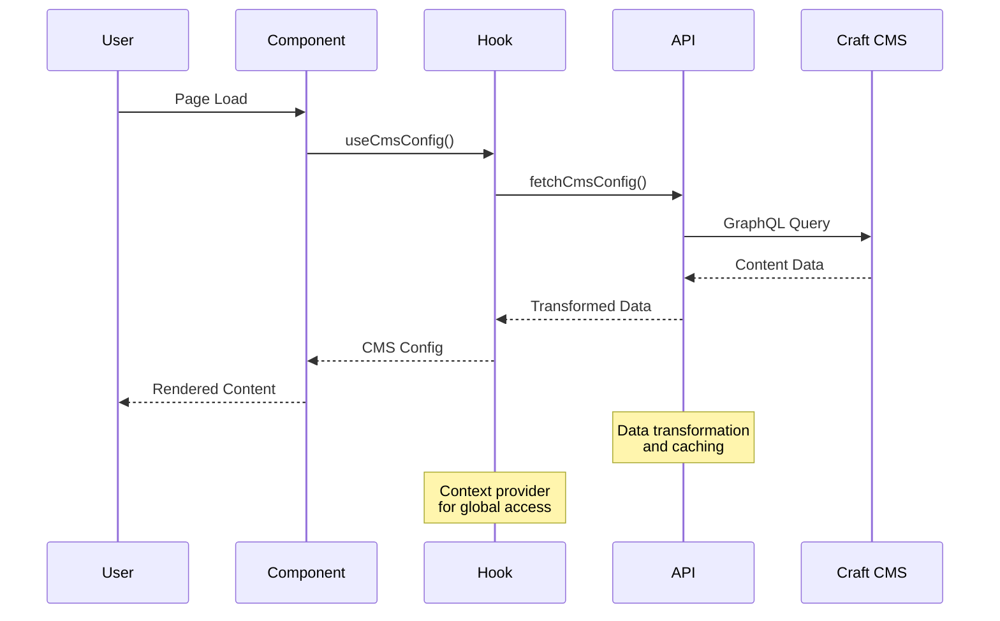
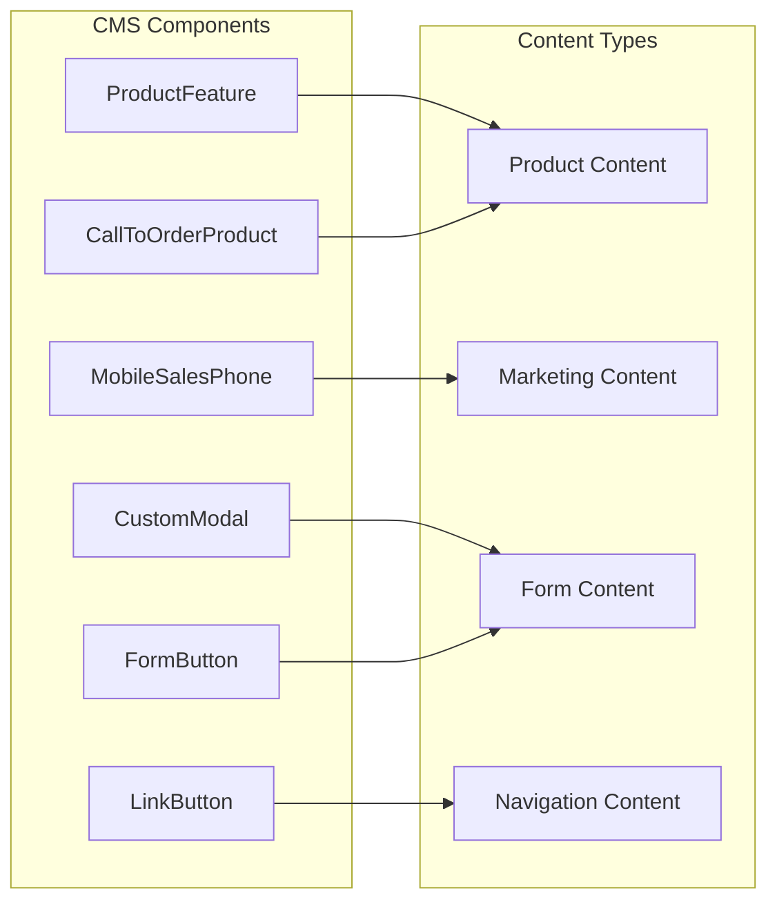
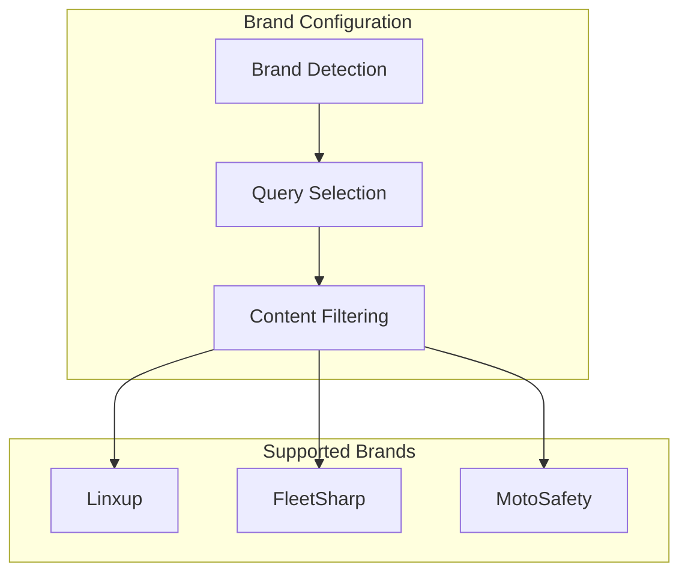
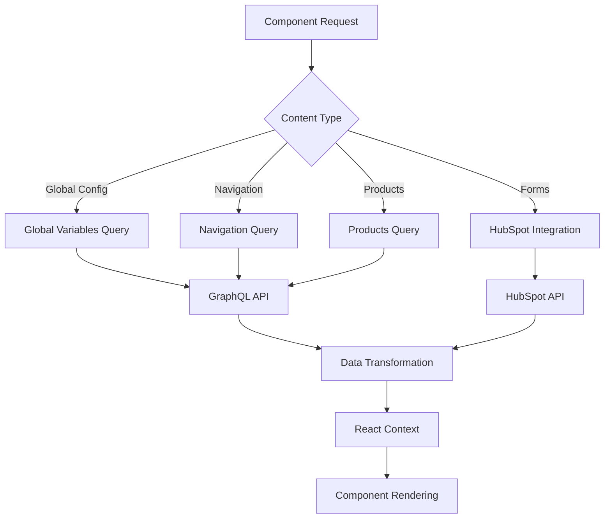
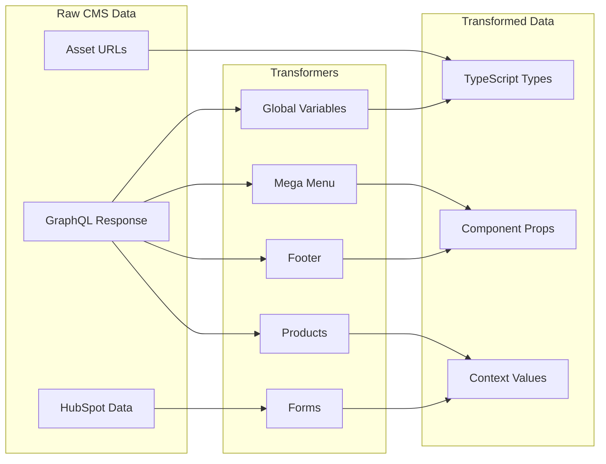
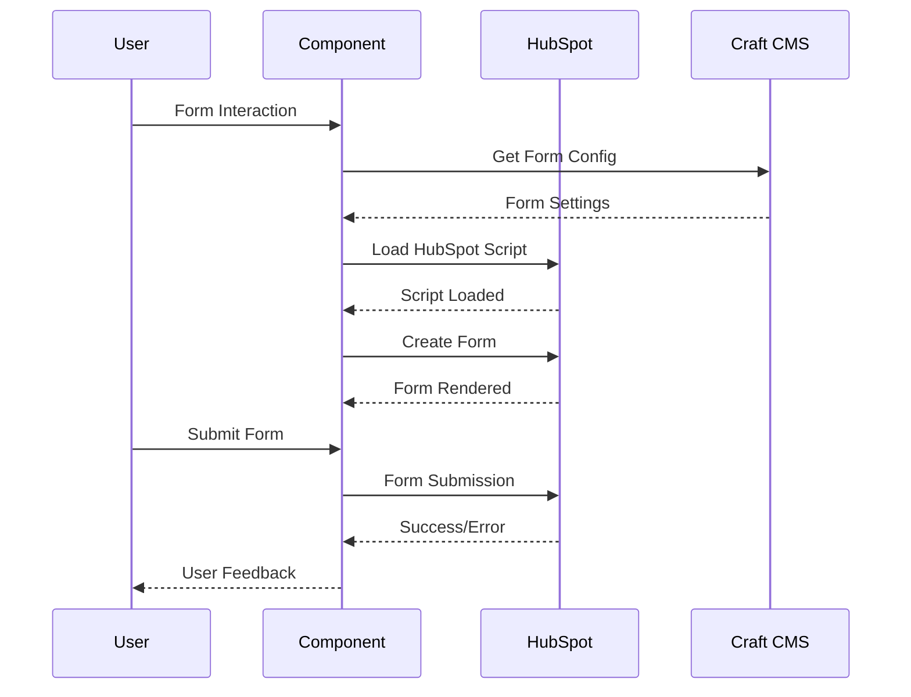

# Craft CMS Integration

This guide explains how the project integrates with Craft CMS to provide content management functionality for the headless e-commerce platform. The integration leverages Craft CMS's GraphQL API to deliver dynamic content, navigation, and configuration data.

## Overview

The Craft CMS integration provides comprehensive content management capabilities with the following key features:

- **Content Management**: Dynamic content delivery for pages, products, and marketing materials
- **Navigation System**: Multi-level navigation with mega menu support
- **Global Configuration**: Centralized management of site-wide settings and variables
- **Form Integration**: HubSpot form integration with custom styling
- **Multi-Brand Support**: Brand-specific content and configuration
- **Component-Based Architecture**: Reusable content components for consistent UI

## Architecture

The integration follows a layered architecture that separates content management from presentation:



## Configuration

The integration requires several environment variables to be configured:

### Required Environment Variables

```bash
# Craft CMS API Configuration
NEXT_PUBLIC_CMS_URL=https://your-craft-site.com/api
NEXT_PUBLIC_CMS_TOKEN=your_craft_api_token

# Brand Configuration
NEXT_PUBLIC_BRAND=linxup  # linxup, fleetsharp, motosafety

```

## Content Management System

The Craft CMS integration uses a sophisticated content structure:



### Global Sets

- **Global Variables**: Site-wide settings like phone numbers, scripts, and contact information
- **E-commerce Settings**: Product-related configuration and tooltips
- **HubSpot Forms**: Form configuration and portal settings
- **Mega Menu**: Navigation structure with multi-column layouts
- **Footer**: Footer content, links, and social media information

## Data Flow

The content delivery follows a structured data flow:



## Component Architecture

The Craft CMS integration uses a component-based architecture:



### Key Components

- **ProductFeature**: Displays product information with images and call-to-action buttons
- **CallToOrderProduct**: Product cards with "Call to Order" functionality
- **CustomModal**: HubSpot form integration with custom styling
- **MobileSalesPhone**: Mobile-optimized phone number display
- **LinkButton**: Navigation and action buttons
- **FormButton**: Form submission buttons with modal support

## Multi-Brand Support

The integration supports multiple brands with brand-specific content:



### Brand-Specific Features

- **Content Queries**: Different GraphQL queries for each brand
- **Styling**: Brand-specific CSS and assets
- **Configuration**: Brand-specific global variables
- **Forms**: Brand-specific HubSpot form configurations

## API Integration

The Craft CMS integration uses GraphQL for efficient data fetching:



### GraphQL Features

- **Efficient Queries**: Only fetch required data
- **Fragments**: Reusable query fragments for common data structures
- **Type Safety**: Full TypeScript support for query responses
- **Caching**: Built-in response caching for performance

## Content Transformers

Data transformation ensures consistent data structure across components:



## Form Integration

The integration includes sophisticated form handling:



### Form Features

- **HubSpot Integration**: Seamless form creation and submission
- **Custom Styling**: Brand-specific form styling
- **Modal Support**: Popup forms for better UX
- **Tracking**: Google Analytics and conversion tracking
- **Validation**: Client and server-side validation

## Content Management

### Global Variables

Manage site-wide settings through Craft CMS:

- **Contact Information**: Phone numbers, email addresses
- **Scripts**: Analytics, tracking, and third-party scripts
- **Branding**: Logos, colors, and brand-specific settings
- **E-commerce**: Product-related tooltips and configuration

### Navigation Management

Create and manage complex navigation structures:

- **Multi-level Menus**: Nested navigation with unlimited depth
- **Mega Menus**: Multi-column navigation layouts
- **Mobile Navigation**: Responsive navigation for mobile devices
- **Call-to-Action**: Integrated CTAs within navigation

### Content Components

Reusable content components for consistent presentation:

- **Product Features**: Highlighted product information
- **Marketing Blocks**: Promotional content and banners
- **Form Components**: Contact and lead generation forms
- **Media Components**: Image galleries and video content
