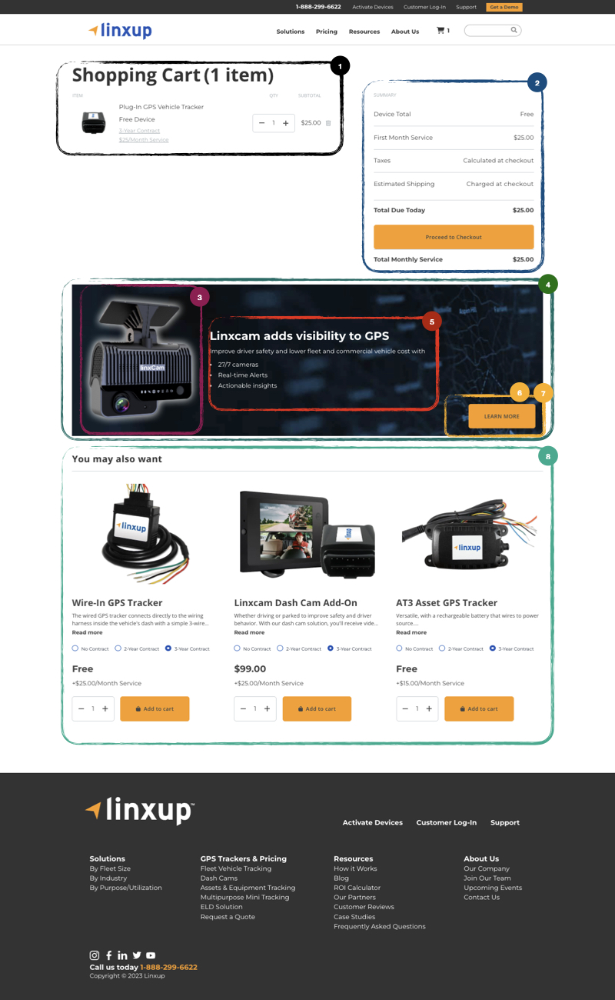

# Cart Page

The **Cart Page** displays the products that a customer has added to their shopping cart, along with pricing, quantity selection, and options for related products.  
It allows users to review their selected items, adjust quantities, remove products, and proceed to checkout.

The page also includes **related product suggestions**, call-to-action buttons, and informational banners, all managed through **Craft CMS** and product data retrieved from **BigCommerce**.

## 🎯 Example page

## Cart Page – Data Sources

The fields and configurations used on the **Cart Page** are managed through two main sources:

- **Craft CMS**:  
  All page content is defined under the **Entries** menu, specifically within the entry named **Cart**.  
  This entry contains structured fields that define banners, callouts, and instructional text.  
  These fields control the static layout, content, and messaging displayed on the page.

- **BigCommerce**:  
  Product-specific data such as product name, price, quantity, image, and availability is retrieved dynamically from BigCommerce.  
  Related products and product suggestions displayed on the Cart Page also pull data directly from BigCommerce to ensure consistency with the live catalog.

Detailed mappings between fields and their respective sources are described in the following sections.

## Cart Fields

### 1. Added Products List

- Field: **Added Products List**
- Location: Product data from BigCommerce
- Source: **BigCommerce**
- Usage: Contains the list of products added to the cart for the current session. Product details such as name, price, quantity, and image are retrieved from BigCommerce.

### 2. Summary

- Field: **Summary**
- Source: **BigCommerce**
- Usage: Displays a summary of the cart, including the total sum of product values and subscription fees.

### 3. Cart Banner Main Image

- Field: **Main Image**
- Location: _Cart Banner_ section in the Cart entry in Craft CMS
- Source: **Craft CMS**
- Usage: Image displayed as the main visual of the cart banner.

### 4. Cart Banner Background Image

- Field: **Background**
- Location: _Cart Banner_ section in the Cart entry in Craft CMS
- Source: **Craft CMS**
- Usage: Defines the background image of the cart banner.

### 5. Cart Banner Content

- Field: **Content**
- Location: _Cart Banner_ section in the Cart entry in Craft CMS
- Source: **Craft CM**
- Usage: Rich text content displayed within the cart banner.

### 6. Cart Banner Button Label

- Field: **Label Button**
- Location: _Cart Banner_ section in the Cart entry in Craft CMS
- Source: **Craft CMS**
- Usage: Defines the text displayed on the button inside the cart banner.

### 7. Cart Banner Button URL

- Field: **URL Button**
- Location: _Cart Banner_ section in the Cart entry in Craft CMS
- Source: **Craft CMS**
- Usage: Defines the link the button navigates to when clicked.

### 8. You May Also Want List

- Field: **You May Also Want**
- Source: Product data from BigCommerce
- Usage: Displays a list of products that are **different from the ones currently in the cart** and marked as **Visible on the Shopping Cart Page** in Craft CMS.
  - Product information such as name, image, and price is retrieved from BigCommerce to ensure consistency with the catalog.
