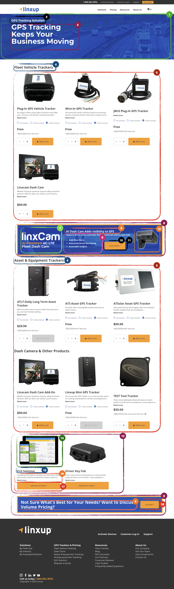

# Ordering Page

The **Ordering Page** provides an overview of how to purchase Linxup products and services.  
It explains the steps of the ordering process, highlights product features, and includes visual callouts and banners guiding users toward product selection or contact options.

Products on this page are **grouped and displayed by category**, allowing users to browse available options by product type.

## 🎯 Example page

## Ordering Page – Data Sources

The fields and configurations used on the **Ordering Page** are managed through two main sources:

- **Craft CMS**:  
  All page content is defined under the **Entries** menu, specifically within the entry named **Customer Add-On Page**.  
  This entry contains structured fields across multiple tabs that define banners, product groupings by category, callouts, and instructional content.  
  These fields control the static layout and textual information displayed on the page.

- **BigCommerce**:  
  Product-related information, such as product names, images, prices, and categories, is retrieved directly from BigCommerce.  
  The page displays products grouped by category using this data to ensure consistency with the active e-commerce catalog.

Further details about each field and integration are described in the following sections.

## Ordering Fields

### 1. Hero Background

- Field: **Hero Image**
- Location: _Hero_ tab on the Customer Add-On Page entry in Craft CMS
- Source: **Craft CMS**
- Usage: Defines the background image displayed in the hero section at the top of the Ordering Page.

### 2. Hero Biline

- Field: **Hero Biline**
- Location: _Hero_ tab on the Customer Add-On Page entry in Craft CMS
- Source: **Craft CMS**
- Usage: Defines a short span of text displayed above the main page title in the hero section, typically used as a subtitle or introductory label.

### 3. Hero Title

- Field: **Hero Title**
- Location: _Hero_ tab on the Customer Add-On Page entry in Craft CMS
- Source: **Craft CMS**
- Usage: Defines the main `<h1>` title of the Ordering Page, displayed prominently in the hero section.

### 4. Category Title

- Field: **Category Title**
- Location: _Body_ tab → **Product Category Listing** section in the Customer Add-On Page entry in Craft CMS
- Source: **Craft CMS**
- Usage: Defines the title displayed above each product category section on the Ordering Page.

### 5. Product List

- Field: **Order Now Product Selector**
- Location: _Body_ tab → **Product Category Listing** section in the Customer Add-On Page entry in Craft CMS
- Source: **BigCommerce** & **Craft CMS**
- Usage: Displays product cards for the selected products associated with each category. Product data (name, image, price, etc.) is retrieved from BigCommerce to ensure synchronization with the catalog.

### 6. Product Feature Background

- Field: **Background Image**
- Location: _Body_ tab → **Product Feature** section in the Customer Add-On Page entry in Craft CMS
- Source: **Craft CMS**
- Usage: Defines the background image for the product feature section on the Ordering Page.

### 7. Left Image / Logo

- Field: **Left Image / Logo**
- Location: _Body_ tab → **Product Feature** section in the Customer Add-On Page entry in Craft CMS
- Source: **Craft CMS**
- Usage: Image displayed on the left side of the product feature section, typically used for logos or product visuals.

### 8. Product Feature Title

- Field: **Product Title**
- Location: _Body_ tab → **Product Feature** section in the Customer Add-On Page entry in Craft CMS
- Source: **Craft CMS**
- Usage: Title of the product feature, displayed prominently in the feature section.

### 9. Product Feature Content

- Field: **Product Content**
- Location: _Body_ tab → **Product Feature** section in the Customer Add-On Page entry in Craft CMS
- Source: **Craft CMS**
- Usage: Rich text content describing the product feature, displayed alongside the title and image in the feature section.

### 10. Product Feature Button Text

- Field: **Button Text**
- Location: _Body_ tab → **Product Feature** section in the Customer Add-On Page entry in Craft CMS
- Source: **Craft CMS**
- Usage: Defines the text displayed on the button within the product feature section.

### 11. Product Feature Button Link

- Field: **Button Link**
- Location: _Body_ tab → **Product Feature** section in the Customer Add-On Page entry in Craft CMS
- Source: **Craft CMS**
- Usage: Defines the URL or page the button in the product feature section links to when clicked.

### 12. Product Feature Right Image

- Field: **Right Image**
- Location: _Body_ tab → **Product Feature** section in the Customer Add-On Page entry in Craft CMS
- Source: **Craft CMS**
- Usage: Image displayed on the right side of the product feature section, complementing the left image and content.

### 13. Product Callouts

- Field: **Call to Order Product**
- Location: _Body_ tab → **Product Category Listing** section in the Customer Add-On Page entry in Craft CMS
- Source: **Craft CMS**
- Usage: Defines the list of products displayed after the main category product list. All these products will include a **Call Now to Order** button.

### 14. Callout Product Image

- Field: **Product Image**
- Location: _Body_ tab → **Product Category Listing** → **Call to Order Product** section in the Customer Add-On Page entry in Craft CMS
- Source: **Craft CMS**
- Usage: Image displayed for each product in the callout list.

### 15. Callout Product Title

- Field: **Product Title**
- Location: _Body_ tab → **Product Category Listing** → **Call to Order Product** section in the Customer Add-On Page entry in Craft CMS
- Source: **Craft CMS**
- Usage: Title of each product displayed in the callout list.

### 16. Callout Product Description

- Field: **Product Description**
- Location: _Body_ tab → **Product Category Listing** → **Call to Order Product** section in the Customer Add-On Page entry in Craft CMS
- Source: **Craft CMS**
- Usage: Short description of each product displayed in the callout list.

### 17. Callout Read More Link

- Field: **Read More Link**
- Location: _Body_ tab → **Product Category Listing** → **Call to Order Product** section in the Customer Add-On Page entry in Craft CMS
- Source: **Craft CMS**
- Usage: Link that navigates to the detailed product page or additional information for each callout product.

### 18. Right Call Now Button

- Field: **Right Call Now Button**
- Location: _Body_ tab → **Product Feature** section in the Customer Add-On Page entry in Craft CMS
- Source: **Craft CMS**
- Usage: Creates a **Callout** button displayed on the right side of the product feature section.
  - The button links to the **Sales Telephone Link** defined in _Globals → Global Variables_.
